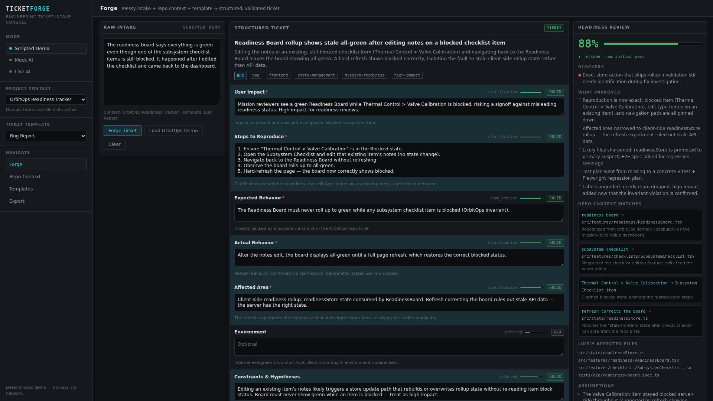

# TicketForge

**AI-as-a-Service for engineering ticket intake.** TicketForge turns messy user reports into structured, honestly-graded, ready-to-work engineering tickets by combining three inputs:

1. **Raw intake** — the report as a human actually wrote it.
2. **A Repo Brief** — reusable repository context produced once by scanning a codebase with Claude Code.
3. **A team-defined ticket template** — the fields your team requires, with per-field instructions.

The output is not chatbot prose. It is a structured ticket where **every field carries metadata**: a confidence score, a quality grade (`missing` / `speculative` / `needs_confirmation` / `solid` / `not_applicable`), a reason for the grade, and a source (`raw_intake` / `repo_context` / `clarification` / `inferred` / `manual`). A readiness score, blockers, and targeted clarifying questions drive a second refinement pass that visibly upgrades the ticket.



## Stack

React + TypeScript + Vite frontend · Node/Express backend · Zod runtime validation · Vitest unit tests · Playwright E2E. No database (localStorage persistence), no auth, no live issue-tracker integrations — export only.

## Run locally

```bash
npm install
npm run dev        # vite (http://localhost:5173) + API (http://localhost:8787)
```

Or serve the production build from Express on one port:

```bash
npm run build
npm start          # http://localhost:8787
```

**No API keys are needed** for Scripted Demo Mode or Mock AI Mode — the app is fully demoable offline.

## Modes

### Scripted Demo Mode (default)
Fully deterministic, key-free walkthrough using canned data for **OrbitOps Readiness Tracker**, a fictional internal mission-readiness tool. Use it to present the product story with zero risk:

1. Click **Load OrbitOps Demo** (Forge screen). This activates the OrbitOps repo brief, the Bug Report template, and a messy intake about a readiness board showing green despite a blocked checklist item.
2. Click **Forge Ticket**. Progress steps play (interpreting → applying repo context → mapping to template → checking readiness), then an initial ticket lands at **62% readiness** — strong fields green, weak fields red/amber, three clarifying questions raised. The Repo Context Matches panel shows that "readiness board" and "subsystem checklist" were understood because of the active repo profile.
3. Click **Use Demo Answers** (or type your own), then **Refine Ticket**. Readiness climbs to **88%**, red/amber fields turn green with a brief highlight, and a **What Improved** summary explains that repro, affected area, likely files, and test plan are now stronger.
4. Open **Export** for Jira / GitHub / Linear / JSON handoff with copy buttons.

### Mock AI Mode
Also key-free and deterministic, but computed live from *your* inputs: it lexically matches the intake against the active repo brief's vocabulary and the template's field instructions, grades each field, scores readiness, and generates clarifying questions. Same input → same ticket, every time. Good for playing with your own intake text and imported repo briefs offline.

### Live AI Mode
Real provider calls, backend-only — **API keys never reach the browser**.

- Prefers **Anthropic** when `ANTHROPIC_API_KEY` is set; falls back to **OpenAI** when `OPENAI_API_KEY` is set.
- Uses structured output (Anthropic forced tool-use; OpenAI JSON-schema response format) constrained to the app's ticket schema.
- Every response is validated with Zod. On validation failure the server retries once with a repair prompt; if it still fails you get a graceful error and your raw intake is preserved.
- Actionable errors for: no API key, provider unreachable, safety refusal, incomplete response, schema validation failure.

Configure via `.env` (copy `.env.example`):

| Variable | Purpose |
| --- | --- |
| `ANTHROPIC_API_KEY` | Enables Anthropic as the preferred provider |
| `ANTHROPIC_MODEL` | Claude model id (defaults to `claude-sonnet-5`) |
| `OPENAI_API_KEY` | Enables OpenAI as the fallback provider |
| `OPENAI_MODEL` | OpenAI model id (defaults to `gpt-4o-mini`) |
| `PORT` | API port (default `8787`) |

Check status at `GET /api/ai/status` or in the sidebar footer when Live AI is selected.

## Repo Context

The **Repo Context** screen makes repository knowledge reusable:

- **Generate Scan Prompt** — a polished prompt you copy into Claude Code while inside a target repo. It asks for a structured **Repo Brief** JSON (project name, stack, architecture summary, key directories, workflows, domain vocabulary, routing hints, test/build commands, definition-of-ready/done hints, risk areas, constraints, likely affected areas) and explicitly forbids including secrets.
- **Import Repo Brief** — paste raw JSON or a markdown-fenced block from a Claude Code answer. It is Zod-validated (with per-field error paths on failure), summarized readably, and stored in localStorage as the active project context for future ticket generation.

The OrbitOps brief ships preloaded so the demo works out of the box.

## Templates

Three editable templates ship by default: **Bug Report**, **Feature Request**, **Research Spike**. On the Templates screen you can add fields, remove optional fields, rename fields, edit per-field AI instructions, and toggle required/optional. Edits persist in localStorage; single-template and reset-all restore the defaults.

## API

| Endpoint | Purpose |
| --- | --- |
| `GET /api/health` | Liveness check |
| `GET /api/ai/status` | Which provider/model Live AI would use, or why it's unavailable |
| `POST /api/forge-ticket` | Raw intake + repo brief + template → structured ticket |
| `POST /api/refine-ticket` | Previous ticket + clarification answers → refined ticket |

## Testing

```bash
npm run typecheck   # tsc --noEmit
npm test            # Vitest: schemas, brief import, templates, exporters, engines, readiness, API
npm run e2e         # builds, then Playwright drives the full scripted demo at 1920x1080
```

The E2E suite covers the complete demo flow (load demo → forge → verify ~62% → demo answers → refine → verify ~88% and improved field grades → export text) plus repo-brief import validation, desktop layout checks, and screenshots (written to `e2e/__screenshots__/`).

## Demo script (for presenting)

1. "Every team gets tickets like this" — read the messy OrbitOps intake aloud.
2. Point at the sidebar: repo brief + template are *standing context*, captured once.
3. Forge. Narrate the progress steps, then the field grades: "the AI is telling us what it *doesn't* know — red and amber, with reasons."
4. Point at Repo Context Matches: "it knew 'readiness board' maps to `ReadinessBoard.tsx` because of the repo brief, not magic."
5. Answer the clarifying questions with **Use Demo Answers** → Refine. Watch readiness jump 62% → 88% and fields flip green.
6. Read the **What Improved** panel — this is the audit trail of the second pass.
7. Export to GitHub markdown, copy, done: "handoff-ready ticket, no integration required."
8. Optional: switch to Mock AI and type your own intake to show it isn't a movie prop; switch to Live AI if a key is configured.

## Known limitations

- **Export-only**: no Jira/GitHub/Linear API integration by design.
- **localStorage persistence**: context, templates, and the current ticket are per-browser; there is no server-side storage or multi-user support.
- **Mock AI is lexical**: deterministic word-overlap heuristics, not semantics — it's a stand-in for the live provider, tuned to demo well, not to be smart.
- **Scripted mode ignores custom input**: by definition it always replays the OrbitOps story, even if you edit the intake first.
- **Live AI quality depends on the configured model**; responses are schema-validated but not fact-checked against a real repository.
- Desktop-first (optimized for 1080p); small screens are not a target.
